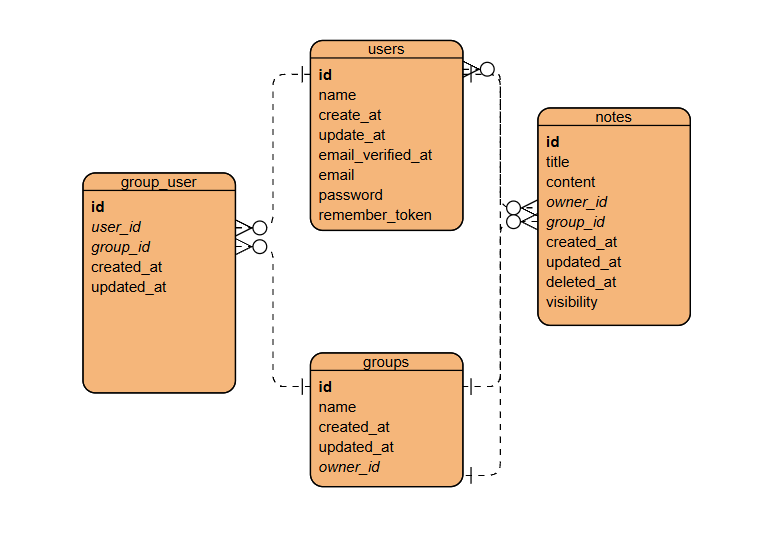

### NotionClone - 多人協作筆記系統
一個基於 Laravel 10 和 React 開發的筆記協作平台，具備群組管理和權限控制功能。

**主要功能：**
1. 筆記管理
   - 支援多種可見度設定（私密/群組/公開）
   - 即時編輯和預覽
   - 軟刪除機制確保資料安全

2. 群組協作
   - 群組建立與管理
   - 群組成員權限控制
   - 群組筆記共享功能

3. 使用者系統
   - 完整的身份驗證
   - 個人筆記管理
   - 群組成員管理

**技術特點：**
- 前端：React + Inertia.js + Tailwind CSS
  - 使用 Inertia.js 實現 SPA 體驗
  - Tailwind CSS 實現響應式設計
  - React Hooks 管理狀態

- 後端：Laravel 10 + MySQL
  - RESTful API 設計
  - Eloquent ORM 關聯操作
  - 多對多關聯實現群組功能

**設計亮點：**
1. 權限控制
   - 三級權限系統（私密/群組/公開）
   - 群組成員訪問控制
   - 筆記編輯權限管理

2. 使用者體驗
   - 即時狀態更新
   - 直覺的操作介面
   - 響應式設計支援多裝置

3. 資料安全
   - 使用軟刪除保護資料
   - 表單驗證確保資料完整性
   - 存取權限嚴格控管

這個專案展示了全端開發能力，包括前後端整合、資料庫設計、使用者權限管理等關鍵技能。

